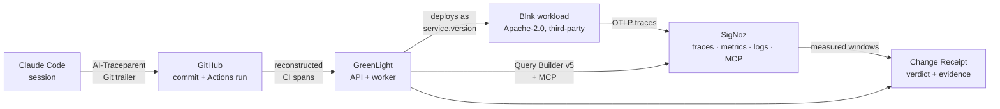

# GreenLight — AI Change Flight Recorder

An AI wrote a one-line config change. It passed all eight CI checks, was
reviewed, merged, and deployed. Median latency on the affected endpoint then
more than doubled.

GreenLight records that gap. It ties an AI session to the commit it produced,
the CI run that validated it, the immutable deployed version, the SigNoz
telemetry that followed, and the evidence that a later change recovered the
service.

Every link is an ID that must resolve in a live SigNoz. When one does not, the
receipt says so rather than rendering a confident blank.

## Architecture



The unit of comparison is the **immutable deployed version**. Each deployment
reports its commit SHA as `service.version`, so "before and after" is a version
comparison rather than an ambiguous wall-clock one:

```
service.name = 'blnk-loan-workload'
  AND service.version = '<commit sha>'
  AND deployment.environment.name = 'hackathon-demo'
  AND http.route = '/balances'
```

The monitored workload is [Blnk](https://github.com/blnkfinance/blnk) `v0.15.1`
at commit `c8fce93`, fetched and verified rather than vendored. It knows nothing
about GreenLight, so a detected regression is not one written to be detected.

## What is proven, and how to check it

| Claim | Verify with | Recorded result |
|---|---|---|
| Three real commits with real CI runs | GitHub Actions on this repo | `6f458c9`, `2fa6e28`, `c65cd73` — all green |
| The regressing change passed CI | PR #64 checks tab | all 8 checks green |
| Each deployment is version-verified | receipt `deployment.versionState` | `verified` for all three |
| A regression was detected | `GET /api/v1/changes/2fa6e28…` | `regressed`, error rate 0% → 38.67% |
| The latency change is visible but under threshold | same receipt `impact` | p95 1.44 ms → 8.17 ms, verdict withheld on latency |
| Recovery was measured, not assumed | receipt for `c65cd73` | `recovered` |
| Custom metrics reach SigNoz | `greenlight.*` metrics | verdicts, AI state, queue depth, dependency health |
| Logs join to traces by commit | log filter `commit_sha` | resolves to a 2-span trace |
| MCP answered independently | `npm run mcp:verify` | p95 1.59 → 8.31 ms, 3 traces, all resolve |
| The stack is pinned, not floating | `bash scripts/signoz-runtime-verify.sh` | 6 images matched by digest |

Full detail: [`docs/BLOG.md`](docs/BLOG.md) explains the design and the three
defects that only running the system revealed.

## Five-minute local quickstart

Prerequisites: Node 24, Docker with Compose v2, Git, curl, OpenSSL, and SigNoz
Foundry `v0.2.16`.

```bash
npm ci
cp .env.demo.example .env.demo
npm run demo:up
```

The first run generates private local secrets, starts the digest-pinned SigNoz
stack, and provisions its administrator. It then stops at one gate: SigNoz does
not expose an API key through automation. Follow the single remediation message
it prints — sign in at `http://127.0.0.1:8080` with the mode-0600 credentials in
`.workloads/signoz.env`, create a service-account key, put it in `.env.demo`,
and rerun `npm run demo:up`.

The rerun fetches and verifies Blnk, seeds synthetic ledger data, and starts
PostgreSQL, the GreenLight API and worker, and the web UI, each health-gated.

```bash
npm run demo:status
# GreenLight: http://127.0.0.1:4173
# SigNoz:     http://127.0.0.1:8080
# Blnk:       http://127.0.0.1:18081
```

`npm run demo:down` stops the stack and preserves every volume.

### Record an evidence chain

With `GITHUB_REPOSITORY` pointing at a repository whose commits you can read:

```bash
node scripts/demo-chain.mjs <baseline-sha> <candidate-sha> [recovery-sha]
```

Each phase deploys a commit as an immutable version, fills the window
GreenLight will actually measure with paced traffic, records the deployment,
and asks for a verdict. Timings come from the API's own settings, so a window
is never evaluated before it closes. A run takes about ten minutes; that is the
measurement windows, not overhead.

Then capture the agent-native view:

```bash
npm run mcp:capture   # needs BASELINE_SHA and CANDIDATE_SHA
npm run mcp:verify
```

### Repository-level verification

```bash
npm run verify        # clean, lint, typecheck, test, build
npm run quality
npm run validate:signoz-assets
bash scripts/signoz-runtime-verify.sh
```

## What it refuses to say

Every receipt carries this, and it is load-bearing:

> Deployment correlation is evidence of temporal and version association, not
> proof that every observed failure was caused by the commit.

Two limitations are stated rather than hidden:

- The recorded error-rate regression came from a genuine PostgreSQL outage
  inside the candidate's measured window. GreenLight reports what it measured
  against the version deployed; it does not assert the commit caused it.
- AI verification reads `missing` for the recorded commits. Marking a change
  `verified` requires a Claude Code session exporting telemetry to SigNoz so
  the exact span resolves. The recorded commits were not authored in such a
  session, and the receipt reports that rather than implying a link.

## Submission

Track 3 — Build Your Own. Inspired by the deployment-guardian problem in
[SigNoz issue #11657](https://github.com/SigNoz/signoz/issues/11657).
See [`docs/SUBMISSION.md`](docs/SUBMISSION.md).

Further reading: [operations runbook](docs/OPERATIONS.md),
[demo state](docs/DEMO_STATE.md),
[telemetry contract](docs/TELEMETRY_CONTRACT.md),
[MCP investigation](docs/MCP_DEMO.md).

## AI assistance disclosure

Planning and implementation may use Codex/ChatGPT, Claude Code, Cursor, or other
AI assistants. AI systems are tools, not repository authors or commit
co-authors. All commits are reviewed and authored under the human maintainer's
verified Git identity. See [PROVENANCE.md](PROVENANCE.md).

## License

MIT. See [LICENSE](LICENSE). The monitored workload is Apache-2.0 and belongs to
its authors.
