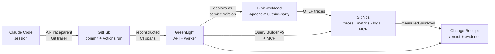

# GreenLight — AI Change Flight Recorder

A coding agent writes a one-line config change — the kind it produces dozens of
a day. It passes every CI check, gets reviewed, merged, and deployed. Latency on
the affected endpoint then degrades, and nothing in the toolchain connects those
facts.

In the recorded run below that change is `2fa6e28`, it passed all eight CI
checks, and p95 on `/balances` rose 7.3x.

GreenLight records that gap. It ties an AI session to the commit it produced,
the CI run that validated it, the immutable deployed version, the SigNoz
telemetry that followed, and the evidence that a later change recovered the
service.

Every link is an ID that must resolve in a live SigNoz. When one does not, the
receipt says so rather than rendering a confident blank.

**Getting started:** [Setup](#setup) · [Run the evidence chain
end to end](#running-the-evidence-chain-end-to-end) · [Use it on your own
repository](#using-it-on-your-own-repository) ·
[Troubleshooting](#troubleshooting)

## Architecture



The unit of comparison is the **immutable deployed version**. Each deployment
reports its commit SHA as `service.version`, so "before and after" is a version
comparison rather than an ambiguous wall-clock one:

```
service.name = 'blnk-loan-workload'
  AND service.version = '<commit sha>'
  AND deployment.environment.name = 'hackathon-demo'
  AND http.route = '/balances'
```

The monitored workload is [Blnk](https://github.com/blnkfinance/blnk) `v0.15.1`
at commit `c8fce93`, fetched and verified rather than vendored. It knows nothing
about GreenLight, so a detected regression is not one written to be detected.

## What is proven, and how to check it

| Claim | Verify with | Recorded result |
|---|---|---|
| Three real commits with real CI runs | GitHub Actions on this repo | `6f458c9`, `2fa6e28`, `c65cd73` — all green |
| The regressing change passed CI | PR #64 checks tab | all 8 checks green |
| Each deployment is version-verified | receipt `deployment.versionState` | `verified` for all three |
| A regression was detected | `GET /api/v1/changes/2fa6e28…` | `regressed` on p95 1.44 ms → 10.45 ms, a 7.3x rise |
| Recovery was measured, not assumed | receipt for `c65cd73` | `recovered` |
| Every published link opens | `npm run verify:receipt-links` | every receipt URL resolves |
| Custom metrics reach SigNoz | `greenlight.*` metrics | verdicts, AI state, alert notifications, queue depth, dependency health |
| Logs join to traces by commit | log filter `commit_sha` | resolves to its span |
| Alerts fire and resolve | SigNoz Alerts page under load | p95 rule `inactive` → `firing` on the candidate, `inactive` on the revert |
| MCP answered independently | `npm run mcp:verify` | 3 traces, all resolve; fails loudly without credentials |
| The AI-link chain is diagnosable | `npm run ai-link:verify` | reports each of the four links separately |
| The stack is pinned, not floating | `bash scripts/signoz-runtime-verify.sh` | 6 images matched by digest |

Full detail: [`greenlight-blog-post.md`](greenlight-blog-post.md) is the
submission-ready project story, with verified screenshots and the limitations
stated plainly. The narrated 2:25 demo is available as
[`signoz-hackathon-end-to-end-demo.mp4`](signoz-hackathon-end-to-end-demo.mp4).

## Setup

Budget about 30 minutes for a first run: roughly 10 minutes of setup, a pause
while you create a SigNoz API key by hand, and then a ~10 minute evidence chain
whose duration is the measurement windows themselves.

Everything runs locally in Docker. Nothing is deployed to a cloud, and no
credential leaves your machine.

### 1. Prerequisites

`scripts/preflight.sh` enforces all of these and names whichever one is missing,
so you can also just start and let it tell you.

| Requirement | Why | Check |
|---|---|---|
| **Node 24.x** (exact major) | The workspace pins `>=24 <25` | `node --version` |
| **Docker** + **Compose v2**, daemon running | Every service is a container | `docker compose version` |
| **SigNoz Foundry `v0.2.16`** (exact) | Generates the SigNoz topology from `casting.yaml` | `foundryctl version` |
| `git`, `curl`, `openssl` | Fetching, health checks, secret generation | usually preinstalled |
| ~8 GB free RAM | ClickHouse, SigNoz, Blnk, PostgreSQL, API, worker, web | — |

Install notes:

- **Node 24** — `nvm install 24 && nvm use 24`. The repo ships `.nvmrc`, so
  `nvm use` in the project root is enough once installed. `npm run demo:up`
  locates a Node 24 install itself (nvm, Homebrew `node@24`) even when it is not
  your default, but running `bash scripts/preflight.sh` directly uses whichever
  `node` is on your `PATH` and will reject anything other than 24.
- **Foundry** — follow <https://signoz.io/docs/install/docker/>. The version is
  pinned in [`deploy/foundry.version`](deploy/foundry.version) and checked
  exactly; a newer `foundryctl` fails preflight rather than silently generating a
  different topology.

These loopback ports must be free: `8080` (SigNoz), `8000` (SigNoz MCP), `4318`
(OTLP), `18081` (Blnk), `4000` (GreenLight API), `4173` (GreenLight web).
Preflight fails with the specific port if one is taken.

### 2. Install and configure

```bash
git clone https://github.com/sid12701/greenlight-ai-change-flight-recorder.git
cd greenlight-ai-change-flight-recorder
npm ci
cp .env.demo.example .env.demo
```

Open `.env.demo`. For a first run reproducing the recorded chain, the defaults
work as they are — leave `GITHUB_REPOSITORY` pointing at this repository, which
is public and read anonymously. To point GreenLight at your own service, see
[Using it on your own repository](#using-it-on-your-own-repository).

`GITHUB_TOKEN` may stay empty. Add a fine-grained read-only token only if you hit
GitHub's anonymous rate limit.

### 3. First bootstrap — it stops on purpose

```bash
npm run demo:up
```

This runs preflight, generates private secrets into `.workloads/` (mode 0600),
starts the digest-pinned SigNoz stack via Foundry, waits for SigNoz and its MCP
server to become healthy, and registers the SigNoz administrator.

**It then exits with status 2 and a remediation message.** That is expected, not
a failure: SigNoz does not expose an API key through automation, so one human
step is unavoidable.

### 4. Create the SigNoz API key

1. Open <http://127.0.0.1:8080>.
2. Sign in with the generated credentials in `.workloads/signoz.env` —
   `cat .workloads/signoz.env` shows `SIGNOZ_BOOTSTRAP_EMAIL` and
   `SIGNOZ_BOOTSTRAP_PASSWORD`.
3. Go to **Settings → Service Accounts**, create an account named `greenlight`,
   and copy its API key.
4. Put it in `.env.demo` as `SIGNOZ_API_KEY=` (replacing the
   `<greenlight-service-account-key>` placeholder).
5. *Optional but recommended* — go to **Settings → Notification Channels**,
   create a channel (any type; a webhook is fine for a local demo), and set its
   name in `.env.demo` as `SIGNOZ_ALERT_CHANNELS=`. SigNoz refuses to store an
   alert rule that names no channel, so leaving this empty means alert rules are
   skipped at import.

### 5. Complete the bootstrap

```bash
npm run demo:up
```

The rerun validates the API key against SigNoz, confirms GitHub can read the
configured repository, fetches and verifies the exact public Blnk release
(`v0.15.1` at `c8fce93`) against its checksum, seeds synthetic ledger data, then
builds and starts PostgreSQL, the GreenLight API, the worker, and the web UI —
each one health-gated before the next begins.

Confirm everything is up:

```bash
npm run demo:status
# demo-status: healthy: SigNoz          (http://127.0.0.1:8080/api/v1/health)
# demo-status: healthy: MCP             (http://127.0.0.1:8000/livez)
# demo-status: healthy: Blnk            (http://127.0.0.1:18081/health)
# demo-status: healthy: GreenLight API  (http://127.0.0.1:4000/readyz)
# demo-status: healthy: GreenLight Web  (http://127.0.0.1:4173/healthz)
```

| Service | URL |
|---|---|
| GreenLight | <http://127.0.0.1:4173> |
| SigNoz | <http://127.0.0.1:8080> |
| Blnk (monitored workload) | <http://127.0.0.1:18081> |

### 6. Import the dashboards and alert rules

`demo:up` does not do this — importing writes to your SigNoz instance, so it is a
separate, explicit step:

```bash
set -a && . ./.env.demo && . ./.workloads/greenlight.env && set +a
npm run signoz:import
```

This imports three dashboards and, when `SIGNOZ_ALERT_CHANNELS` is set, two alert
rules. It updates by title and preserves dashboard IDs, so it is safe to re-run.

Sourcing both files is what makes this work: `.env.demo` carries `SIGNOZ_URL`,
`SIGNOZ_API_KEY` and `SIGNOZ_ALERT_CHANNELS`, while `.workloads/greenlight.env`
carries the generated `GREENLIGHT_ALERT_WEBHOOK_KEY` the alert channel
authenticates with. Keep that shell open — the commands below use the same
variables.

## Running the evidence chain end to end

Bootstrapping gives you a running system with no history. A receipt only says
something once a version has been deployed and measured, which is what this
does.

### What you need first

Three commit SHAs from the repository in `GITHUB_REPOSITORY`, each of which has a
completed CI run for the workflow named in `GREENLIGHT_PRIMARY_WORKFLOW_NAME`:

- a **baseline** — a known-good version,
- a **candidate** — the version under suspicion,
- a **recovery** — optional; the fix or revert.

To reproduce the recorded run exactly, use the three commits from this
repository's own history:

```bash
BASELINE=6f458c91ccfd2dd0ba1e4f1445a19db66ccf52ee
CANDIDATE=2fa6e2861eabf162a26af0d0ef012124865811df
RECOVERY=c65cd730b405b88c6d83a7b0f7d7c024f98e1dcd
```

### Record the chain

```bash
npm run demo:chain -- "$BASELINE" "$CANDIDATE" "$RECOVERY"
```

Each phase deploys the commit as an immutable `service.version`, fills the window
GreenLight will actually measure with paced traffic, records the deployment, and
asks for a verdict. Timings come from the API's own settings, so a window is
never evaluated before it closes.

**This takes about ten minutes, and that is the measurement windows, not
overhead.** Each phase waits out a 15s warm-up, a 90s measured window, and a 15s
ingestion delay before SigNoz is queried. The script prints each phase as it
goes and ends with a JSON summary.

The recovery commit is optional — omit it to stop after the regression verdict.
If a later phase fails, the baseline stays frozen and you can resume without
re-recording it:

```bash
npm run demo:chain -- --resume-recovery "$RECOVERY" "<incident-id>"
```

### Read the result

Open <http://127.0.0.1:4173>, or go straight to the receipt:

```
http://127.0.0.1:4173/changes/<candidate-sha>
```

The receipt shows the verdict, the baseline and observed windows with their
metrics, the CI run, the deployed version and image digest, the AI-session link
state, and every evidence link. Links that could not be resolved in SigNoz are
shown as failed rather than hidden.

One thing on that page surprises people. The `role=baseline` deployment is
**frozen** on first capture and reused by every later run, so a receipt's
baseline and observed windows can sit hours apart in wall-clock time. That is
intended: the comparison is scoped to an immutable `service.version`, so elapsed
time between the two captures is not part of it. The receipt states this where
it prints the two windows. See [`docs/DEMO_STATE.md`](docs/DEMO_STATE.md).

Check the same thing over the API:

```bash
curl -s http://127.0.0.1:4000/api/v1/changes/"$CANDIDATE" | jq '.impact'
```

Confirm every published link actually opens:

```bash
npm run verify:receipt-links
```

### The dependency-failure scenario

A separate, explicitly labelled scenario for the different question — what
GreenLight does when something the commit never touched fails inside a measured
window. It stops the workload's database on purpose:

```bash
bash scripts/demo-reset.sh
npm run demo:dependency-failure -- "$BASELINE" "$CANDIDATE"
```

It reports `regressed` and refuses to attribute the failures to the commit.
Keeping this apart from `demo:chain` is deliberate: a verdict is only evidence
about a change if nothing else was done to the service while it was measured.

### Ask SigNoz MCP the same questions

```bash
BASELINE_SHA="$BASELINE" CANDIDATE_SHA="$CANDIDATE" npm run mcp:capture
npm run mcp:verify
```

`mcp:capture` runs a real MCP investigation over streamable HTTP and records the
transcript; `mcp:verify` checks that the trace IDs it cited resolve in SigNoz. It
fails loudly rather than falling back to a direct query. See
[`docs/MCP_DEMO.md`](docs/MCP_DEMO.md).

### Everyday operation

```bash
npm run demo:status   # health of all five services
npm run demo:down     # stop the stack, preserve every volume
npm run demo:up       # bring it back up
bash scripts/demo-reset.sh   # clear transient demo rows, keep the frozen baseline
```

`demo-reset.sh` is a *soft* reset: it preserves changes, pipeline runs, the
frozen baseline deployment, and all SigNoz telemetry. See
[`docs/DEMO_STATE.md`](docs/DEMO_STATE.md) for exactly what survives and why.

## Using it on your own repository

GreenLight is built around one assumption: **the deployed service reports its
commit SHA as `service.version`**. Version comparison is the whole mechanism, so
a workload that does not do this cannot be measured.

To point it at your own service:

1. **Emit the right resource attributes.** Your service must report
   `service.name`, `service.version` (the full commit SHA), and
   `deployment.environment.name` on its spans, and set `http.route` on server
   spans. See [`docs/TELEMETRY_CONTRACT.md`](docs/TELEMETRY_CONTRACT.md) for the
   attributes GreenLight queries and the ones it deliberately does not assume.
2. **Set `.env.demo`:** `GITHUB_REPOSITORY` to your `owner/name`,
   `GREENLIGHT_PRIMARY_WORKFLOW_NAME` to the workflow whose run counts as that
   commit's CI result, and `GREENLIGHT_DEMO_BRANCH` if it is not `main`. Add a
   read-only `GITHUB_TOKEN` for a private repository.
3. **Allow your health-check origin.** `GREENLIGHT_HEALTH_ALLOWED_ORIGINS` must
   contain the origin of the `healthUrl` you post with a deployment, or the API
   rejects it. The check runs *inside the API container*, so the origin has to
   be one that container can reach — `http://host.docker.internal:<port>` for a
   service on the Docker host, not `http://127.0.0.1:<port>`.
4. **Record deployments.** `POST /api/v1/deployments` with a `deploy` scoped key
   when you ship. `scripts/lib/demo-runtime.mjs` is a worked example of the call.
5. **Re-point the dashboard.** `signoz/dashboards/deployment-impact.json` ships
   with the recorded demo's service and version as its variable defaults. Edit
   them, or change them in the SigNoz UI after import, or the dashboard opens on
   a version with no telemetry in your instance.
6. **Tune the windows** if your traffic is lighter than the demo's:
   `GREENLIGHT_MIN_SPANS` (default 200) is the floor below which a window is
   reported as `insufficient_data` rather than being decided on thin evidence.

When one workflow produces several runs for a commit — which
`on: [push, pull_request]` does on any branch with an open pull request — the
most recently updated run is reported as primary and the rest are kept as
related context. If two *different* workflows share the configured name, that is
a genuine ambiguity and the sync fails until you set
`GREENLIGHT_PRIMARY_WORKFLOW_ID` to the one you mean.

The demo scripts (`demo:chain`, `demo:dependency-failure`) are written around
Blnk specifically and will not drive a different workload unchanged; the API they
call is generic, and is the integration surface.

## Troubleshooting

| Symptom | Cause and fix |
|---|---|
| `preflight: error: Required command is missing: foundryctl` | Install SigNoz Foundry `v0.2.16` per <https://signoz.io/docs/install/docker/> |
| `foundryctl v0.2.16 is required` | Version must match [`deploy/foundry.version`](deploy/foundry.version) exactly |
| `Node 24 is required` | `nvm install 24 && nvm use 24` |
| `loopback port NNNN is occupied` | Stop whatever holds it; preflight names the port and the service |
| Bootstrap exits **2** with a SigNoz message | Expected on first run — do [step 4](#4-create-the-signoz-api-key) |
| `SIGNOZ_API_KEY was rejected` | The key is wrong or was revoked; create a new service-account key |
| `GitHub cannot read <repo>` | Repository is private or misspelled; add a read-only `GITHUB_TOKEN` |
| Alert rules were not imported | `SIGNOZ_ALERT_CHANNELS` is empty — create a channel and name it |
| Verdict is `insufficient_data` | The window held fewer than `GREENLIGHT_MIN_SPANS` spans |
| Verdict is `integration_error` | SigNoz could not answer. This is not a pass — check `npm run demo:status` |
| Receipt says `AI link: missing` | Expected unless the commit was authored in an instrumented Claude Code session. Run `npm run ai-link:verify` to see which of the four links is unarmed, and read [`docs/AI_LINK.md`](docs/AI_LINK.md) |

More detail on operating the stack: [`docs/OPERATIONS.md`](docs/OPERATIONS.md).

## Verifying the repository itself

No running stack required:

```bash
npm run verify                 # clean, lint, typecheck, test, build
npm run quality                # policy gates: no committed credentials, no forbidden deps
npm run validate:config        # every documented setting matches the schema
npm run validate:telemetry     # the telemetry contract matches its recorded fixture
npm run validate:signoz-assets # dashboards and alert rules are schema-valid
```

With the stack running:

```bash
npm run validate:signoz-stack       # 6 images version- and digest-pinned
bash scripts/signoz-runtime-verify.sh
npm run test:integration            # live SigNoz query contract
```

## What it refuses to say

Every receipt carries this, and it is load-bearing:

> Deployment correlation is evidence of temporal and version association, not
> proof that every observed failure was caused by the commit.

One limitation is stated rather than hidden:

- AI verification reads `missing` for the recorded commits. Marking a change
  `verified` requires a Claude Code session exporting telemetry to SigNoz so the
  exact span resolves. The recorded commits were not authored in such a session,
  and the receipt reports that rather than implying a link.
  [`docs/AI_LINK.md`](docs/AI_LINK.md) is the procedure for producing one, and
  `npm run ai-link:verify` reports which of the four links is not yet armed.

An earlier version of the demo injected a PostgreSQL outage inside the
candidate's measured window, and the verdict fired on the resulting error rate
rather than on the latency the commit caused. That is now a separate, explicitly
labelled scenario, because a verdict is only evidence about a change if nothing
else was done to the service while it was being measured.

## Submission

Track 3 — Build Your Own. Inspired by the deployment-guardian problem in
[SigNoz issue #11657](https://github.com/SigNoz/signoz/issues/11657).
See [`docs/SUBMISSION.md`](docs/SUBMISSION.md).

Further reading: [AI-session link](docs/AI_LINK.md),
[operations runbook](docs/OPERATIONS.md),
[demo state](docs/DEMO_STATE.md),
[telemetry contract](docs/TELEMETRY_CONTRACT.md),
[MCP investigation](docs/MCP_DEMO.md).

## AI assistance disclosure

Planning and implementation may use Codex/ChatGPT, Claude Code, Cursor, or other
AI assistants. AI systems are tools, not repository authors or commit
co-authors. All commits are reviewed and authored under the human maintainer's
verified Git identity. See [PROVENANCE.md](PROVENANCE.md).

## License

MIT. See [LICENSE](LICENSE). The monitored workload is Apache-2.0 and belongs to
its authors.
