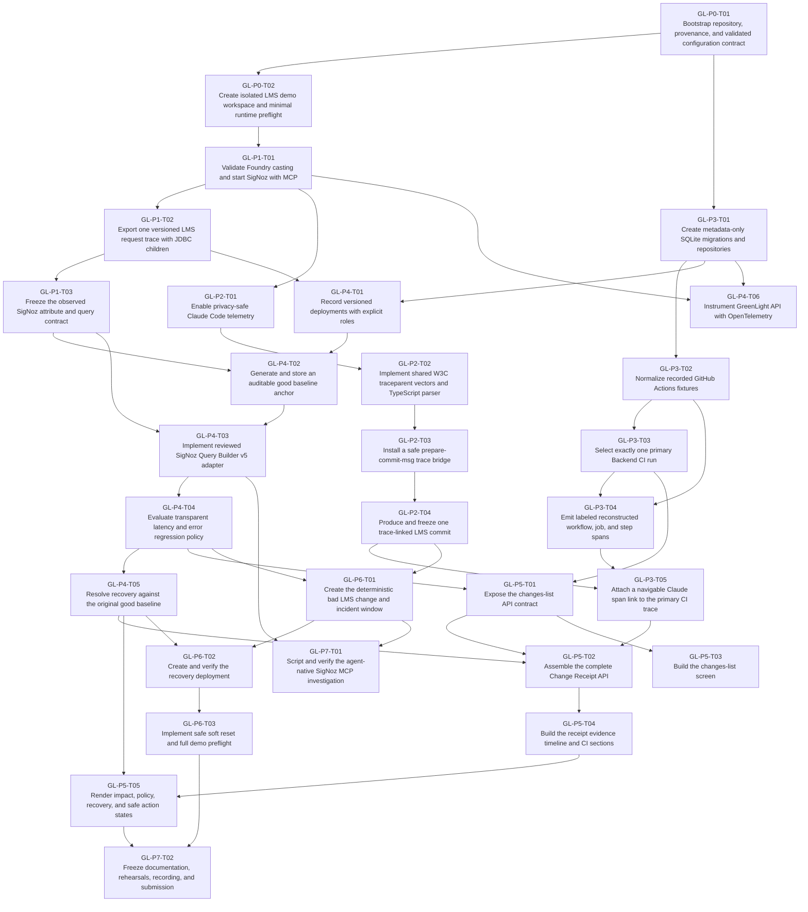

# Dependency Graph

The graph shows hard dependencies only. Phase 5 UI can overlap later Phase 4 work once its API contracts are stable.

## Critical-path discipline

- Do not start P1 work while an unblocked P0 task is available.
- The Claude-to-CI linkage pivot remains time-boxed.
- GL-P3-T05 is a hard dependency of the full receipt and must run immediately when unblocked.
- Phase 6 incident tuning begins as soon as the evaluator is ready and can overlap Phase 5 UI work.
- End-to-end incident visibility is verified in GL-P7-T02 after both the incident and receipt UI are complete.
- Phase 7 begins only after two stable incident/recovery rehearsals.
