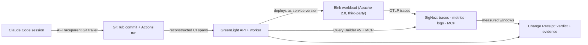

# A flight recorder for AI-authored change: building GreenLight on SigNoz

An AI wrote a one-line config change. It passed all eight CI checks. It got reviewed, merged, deployed. p95 latency on the affected endpoint then went up 7.3x.

Nothing was broken in a way CI could see, because nothing CI tests was actually wrong. That gap — "the pipeline is green" vs. "production is fine" — is what I built GreenLight to record, for the **Agents of SigNoz** hackathon by WeMakeDevs and SigNoz (Track 3, Build Your Own).

This post walks through what GreenLight does, how it leans on SigNoz for basically everything it claims, and the three bugs that only showed up once I stopped reading the code and started running it.

Repo: `https://github.com/sid12701/greenlight-ai-change-flight-recorder`
Demo video: *[YouTube link — placeholder, recording per `docs/VIDEO_SCRIPT.md`]*
Screenshots referenced below live in `audit/screenshots/` in the repo.

**AI assistance disclosure:** planning and implementation used Claude Code and other AI coding assistants throughout, as permitted by the hackathon rules. AI is a tool here, not a co-author — every commit is authored and reviewed under my own Git identity (see `PROVENANCE.md`).

---

## The bug that started it

Here's the entire diff that caused the regression I use as GreenLight's running example:

```diff
   "data_source": {
     "dns": "postgres://...",
     "max_open_conns": 20,
-    "max_idle_conns": 5
+    "max_idle_conns": 5,
+    "conn_max_lifetime": 1000000
   },
```

Reads like sensible tuning — "recycle pooled DB connections periodically." The commit message says exactly that.

`conn_max_lifetime` is a Go `time.Duration`. Decoded from JSON, a `time.Duration` is nanoseconds. `1000000` isn't the ~16 minutes it looks like. It's **one millisecond**. The service dutifully tore down every Postgres connection almost the instant it opened one and spent its time reconnecting instead of serving requests. On `/balances`, p95 went from 1.44 ms to 10.45 ms and p90 from 1.19 ms to 8.71 ms.

No test catches this. No type error, no lint failure, no schema violation — it's a valid integer in a valid field. You find it in production or you don't find it. That's the exact class of failure GreenLight is built around.

## What GreenLight actually does

It ties an AI-authored change to what happened after it shipped:

```
AI session ──▶ commit ──▶ CI run ──▶ deployment ──▶ telemetry window ──▶ verdict
```



Every arrow above is an ID that has to resolve in a live SigNoz. If one doesn't resolve, the receipt says so instead of quietly rendering a confident blank. That "say so, don't fake it" rule is the actual design principle underneath everything else — I'll come back to it.

The comparison unit is the **immutable deployed version**. Every deployment reports its commit SHA as `service.version`, and every SigNoz query is scoped to it:

```
service.name = 'blnk-loan-workload'
  AND service.version = '<commit sha>'
  AND deployment.environment.name = 'hackathon-demo'
  AND http.route = '/balances'
```

"Before and after" as wall-clock time is ambiguous — deploys overlap, rollbacks happen, traffic shifts. "Before and after" as *version* isn't. That scoping is the whole trick, and it's why the same query shape works for the verdict logic, the dashboard, and the MCP investigation.

### The workload isn't mine, on purpose

GreenLight monitors [Blnk](https://github.com/blnkfinance/blnk) `v0.15.1`, an Apache-2.0 financial ledger, pinned to commit `c8fce93`. It's fetched and verified at build time, never vendored — a verification step checks the checkout's origin, tag, SHA, and that the one approved OpenTelemetry patch is its only modification.

This matters more than it sounds. If I'd written the monitored service myself, "GreenLight detected a regression" would be a story about code written to be detected. Blnk knows nothing about GreenLight. It emits OpenTelemetry because it already did, before I ever touched it.

Two upstream quirks had to be worked around at the container boundary instead of patched: `v0.15.1` declares a `--config` flag but its pre-run hook reads `./blnk.json` regardless, and its PostHog/Typesense integrations are disabled for this stack.

## Five ways GreenLight leans on SigNoz

This is the part the judging criteria care most about, so I'll go feature by feature.

**1. Traces decide the verdict.** Evaluation is two Query Builder v5 queries in one round trip: query A returns count, p90, and p95 for the version scope; query B returns the error count for the same scope with `has_error = true`. A verdict needs both.

| Guard | Rule |
|---|---|
| Latency | observed p95 > baseline × 1.5 **and** > baseline + 2 ms |
| Error rate | observed ≥ baseline + 2pp **and** ≥ 5% absolute |
| Data | ≥ 200 completed spans in **both** windows |

That 2 ms floor used to be 250 ms, which is the more "obviously right" number — it's roughly where a human notices latency. But a *perceptible*-duration floor is scale-dependent: on a route whose baseline p95 is 1.44 ms, a 250 ms floor demands 251 ms before latency can be reported at all. That's a 174x regression required to even qualify. Under that old policy, this run's real 7.3x regression would have been measured, shown on the receipt, and then excluded from the verdict — technically honest, practically useless. Policy v2 swaps the perception floor for a resolution floor (2 ms, comfortably above span timing jitter) and keeps the 1.5x multiplier to still suppress noise on slow endpoints. Both policies stay in the code, and every stored verdict names which one decided it, so an old receipt still explains itself.

**2. Metrics answer what traces can't.** A verdict is a decision; queue depth and dependency health are ongoing states, not one-off events, so they need real instruments:

| Metric | Type | What it answers |
|---|---|---|
| `greenlight.regression.verdicts` | counter | what's been decided, by status and route |
| `greenlight.change.ai_verification` | counter | how many changes carry a resolvable AI link |
| `greenlight.jobs.queue_depth` | gauge | is work stuck |
| `greenlight.dependency.available` | gauge | is GitHub, SigNoz, or the DB down |

Job counts deliberately report **zero** for states holding no rows — a gauge that stops emitting looks identical to a collector that died, and telling those two apart is the entire point of watching queue depth. SigNoz query failures are also counted, as `integration_error`, and never disguised as a verdict; skipping that count would make totals imply SigNoz always answered, which it doesn't always.

**3. Alerts that actually fire.** Two rules — p95, and a *true* error rate (errored spans / all spans as one Query Builder v5 formula, not a raw error count that rises with traffic alone). Both had the same two failure modes, both invisible from the SigNoz UI:

- Dashboard variables don't exist for alert rules. A filter written as `service.name = $service` gets stored verbatim, accepted, listed — and matches nothing, forever. Fix: the asset declares its scope in a `variables` block that GreenLight expands before posting, and the validator rejects anything still containing a `$`.
- A version-pinned alert is a contradiction. Scoping a rule to one immutable `service.version` means it can only ever describe a version that already existed when the rule was written — it can never warn about the *next* deploy, which is the only thing an alert is for. So the rules follow environment + route, not version; deciding what a specific version did is the receipt's job, not the alert's.

The p95 threshold sits at 5 ms (above this route's healthy 1.4 ms, below the ~10 ms the regression produces) so it separates the two states instead of restating either. Under load on the candidate, the rule goes `inactive → firing`, and back to `inactive` on the revert.

One thing didn't work, and I'm reporting it rather than glossing it: SigNoz refuses to store a rule with no notification channel, so the importer provisions a channel pointing at an authenticated GreenLight webhook receiver. The receiver itself works — SigNoz rejects it without credentials, accepts it with them, and every call gets logged with trace context plus a metric. But with the rule firing continuously for several minutes, no webhook call ever arrived. The channel is what makes the rule storable; delivery is unverified, and I'd rather say that than have it discovered.

**4. Logs join the story back together.** API and worker logs ship to SigNoz over OTLP carrying trace context, so a log line resolves to its span. Worker jobs that name a commit carry `commit_sha`, because someone investigating an incident usually arrives holding a commit, not a job ID:

```
commit_sha = c65cd730b405…  →  "job succeeded"  →  trace 5f892180…
  ├─ deployment.started      (blnk-loan-workload)
  └─ job deployment_record   (greenlight-worker)
```

No commit gets invented for job kinds that genuinely don't reference one — an absent `commit_sha` means the job wasn't about a single commit, not that the join failed.

**5. MCP asks the questions an investigating agent would.** Rather than only hitting the query API, GreenLight also asks SigNoz's MCP server the same questions a human (or agent) investigator would, over streamable HTTP, and records the transcript:

| | baseline `6f458c9` | candidate `2fa6e28` |
|---|---|---|
| p95 | 1.59 ms | 8.31 ms |
| error rate | 0% | 32.89% |

Three trace IDs get cited in that transcript and each one resolves. There's deliberately no direct-API fallback here — if MCP can't answer, the capture fails and writes nothing, because a transcript that didn't actually come from MCP would misrepresent what it claims to be. These numbers come from a wider window than the receipt's own evaluation, so they corroborate the verdict rather than just restating it.

*[Screenshot placeholder: SigNoz dashboard, "Deployment Impact" panel showing the p95 step change across `service.version`. Source: `signoz/dashboards/deployment-impact.json`.]*

## Three bugs that only running it revealed

The blog-guide advice to "write from real experience" is easy to agree with and hard to act on for a project like this, so here's the concrete version — three defects that no amount of reading the diff would have surfaced:

**The load generator was measuring itself.** It accepted a `--duration-seconds` flag and never used it to pace anything. 250 requests finished in under 0.2 seconds, the workload's own rate limiter rejected 90 of them, and a "healthy" baseline reported a 36% error rate that belonged entirely to the load tool, not the service. A baseline captured from that traffic would have poisoned every downstream verdict.

**The deployment API could never have worked in containers.** It runs its own health check before recording a deployment, from inside a container that reaches the host via `host.docker.internal` — but the health-origin allowlist only permitted `http://127.0.0.1:18081`, which inside that container is *itself*, not the host. It failed closed, correctly, and had apparently never been exercised in the containerized path before.

**Absent evidence was reported as invalid evidence.** The AI-link parser returns a result object for a missing Git trailer rather than `null`, so a `parsed ? "invalid" : "missing"` expression always evaluated to `"invalid"` — the `missing` branch was dead code. Every commit without an AI trailer got recorded as having a *malformed* one, which tells a reader the commit tried to record an AI session and botched it — a claim there was zero evidence for. For a project whose entire premise is "don't overstate the evidence," that was the worst of the three.

## What it refuses to say

Every receipt carries this sentence, and it's load-bearing, not decoration:

> Deployment correlation is evidence of temporal and version association, not proof that every observed failure was caused by the commit.

I know that sentence is load-bearing because I broke it once. An earlier version of the demo injected a real PostgreSQL outage inside the candidate's measured window, and the verdict fired on the resulting error rate rather than on the latency the commit actually caused. Nothing was fabricated and everything was disclosed — but the headline claim was "this change regressed the service," and the actual mechanism was something else entirely. A tool that overstates once is a tool you double-check forever after, and that standard applies to the demo, not just the product. So the two scenarios are now separate: `demo-chain.mjs` measures what a version did and injects nothing into it; `demo-dependency-failure.mjs` deliberately stops the workload's database inside the window and exists specifically to show GreenLight reporting failures it measured, while refusing to attribute them to a commit that never touched that dependency.

Other places the same restraint shows up: a percentage change computed from a zero baseline returns `null` instead of `"Infinity%"`; an unresolved CI conclusion stays neutral instead of being guessed at; `insufficient_data` and `integration_error` are distinct outcomes, and neither is allowed to masquerade as "healthy."

*[Screenshot placeholder: Change Receipt page, verdict banner reading "regressed" with the p95 comparison and the disclaimer sentence visible. Source: `audit/screenshots/03-receipt.png`.]*

*[Screenshot placeholder: the same receipt's "missing evidence" state, showing an unresolved link reported honestly instead of hidden. Source: `audit/screenshots/05-receipt-missing.png`.]*

## The recorded run

Three real commits, three real GitHub Actions CI runs, three version-verified deployments:

| Phase | Commit | CI | Verdict |
|---|---|---|---|
| Baseline | `6f458c9` | ✅ | frozen |
| Candidate | `2fa6e28` | ✅ **all 8 checks green** | **regressed** |
| Recovery | `c65cd73` | ✅ | **recovered** |

Measured on `/balances`: p95 went **1.44 ms → 10.45 ms**, a 7.3x rise, across 257 and 260 completed spans in the two windows with no errors in either. The candidate passing every CI check isn't an embarrassment to report — it's the entire premise. The pipeline did its job correctly. The thing that was wrong just wasn't the kind of thing a pipeline can see.

## What I'd do differently / where it's headed

The verdict logic today is scoped to one route on one service, and the query interface is already parameterized on service, version, environment, and route — so widening it is mostly a baseline-selection problem, not an architecture problem. Right now the baseline is "the last frozen good deployment"; a rolling window of healthy versions would generalize better. Alert notification delivery is the other open item — the channel is proven to authenticate and log, but actual webhook dispatch from SigNoz has never been observed firing in this stack, and I'd want that closed out before trusting it in anything real.

## Try it

```bash
git clone https://github.com/sid12701/greenlight-ai-change-flight-recorder
cd greenlight-ai-change-flight-recorder
cp .env.demo.example .env.demo    # two external credentials
npm run demo:up                   # health-gated: SigNoz, workload, API, web
```

The whole stack is pinned by manifest digest — SigNoz `v0.134.0`, its collector `v0.144.6`, MCP `v0.9.0` — and a runtime verifier checks every running container against its pin before the demo is allowed to claim anything. `casting.yaml` and `casting.yaml.lock` are committed at the repo root for judges re-running it through Foundry.

MIT licensed. The monitored workload is Apache-2.0 and belongs to someone else, which is rather the point.
