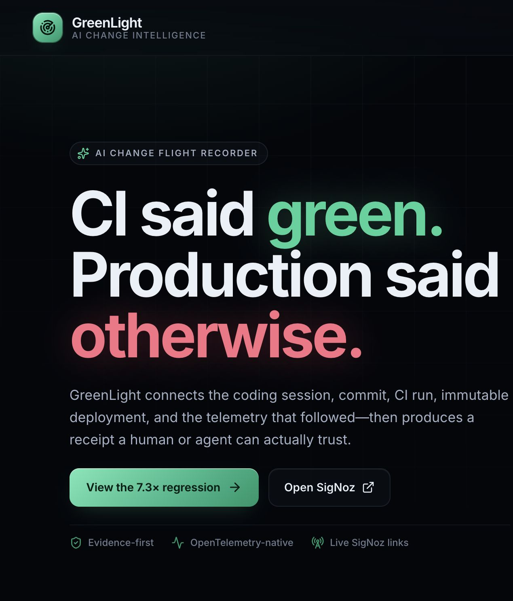
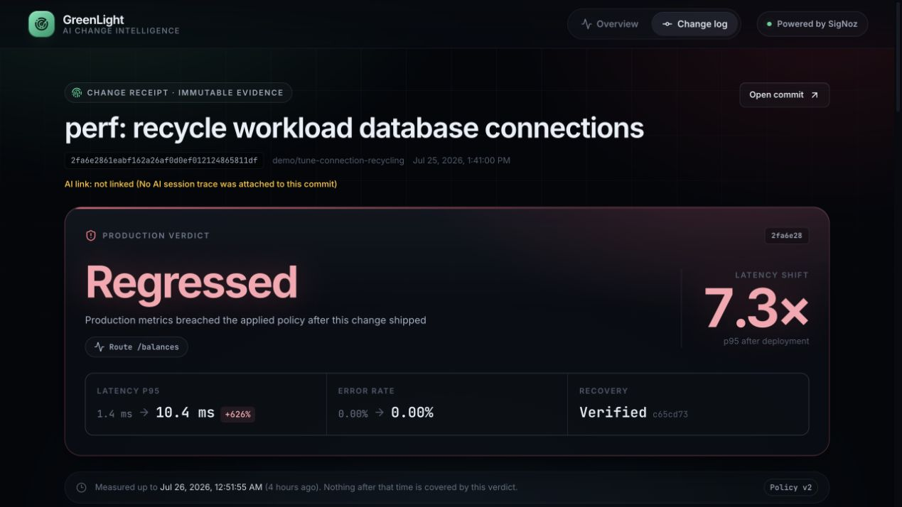
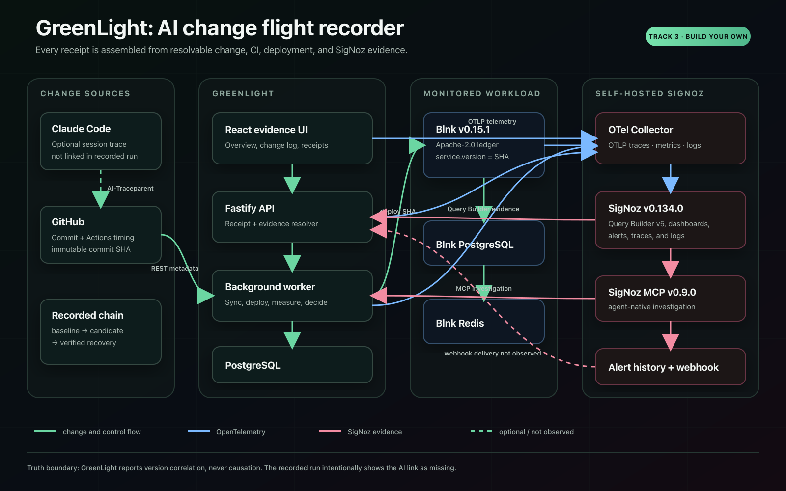
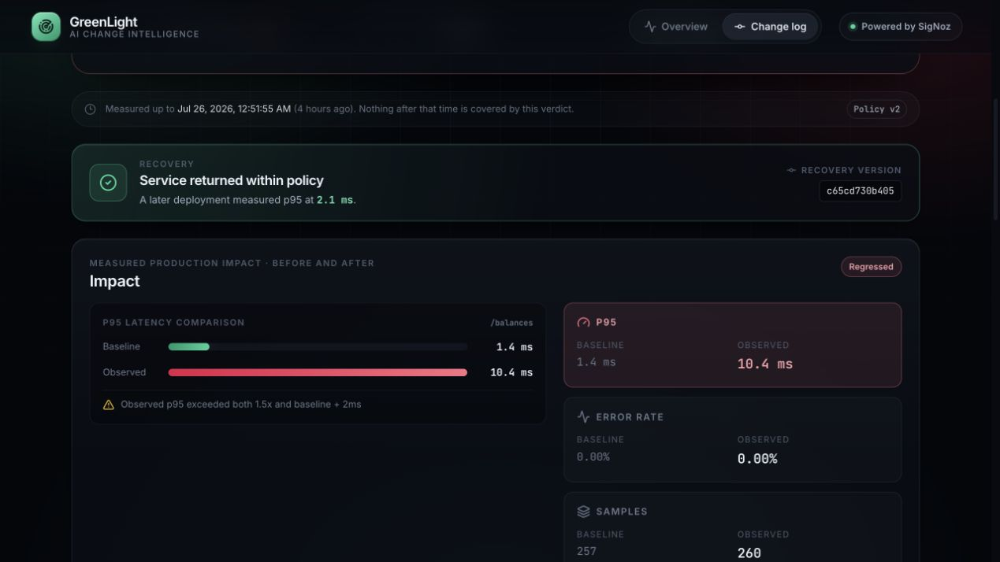
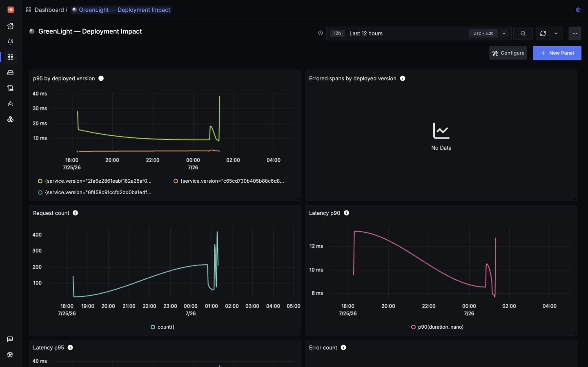
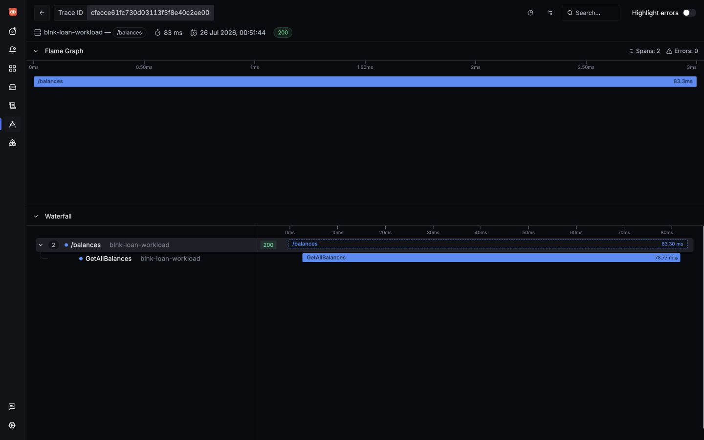
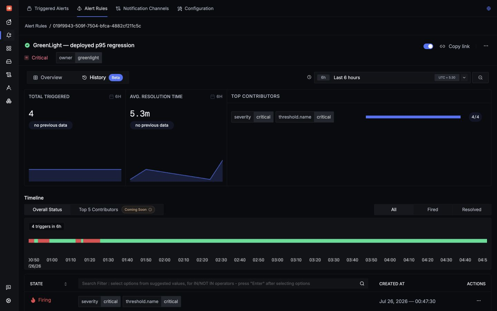
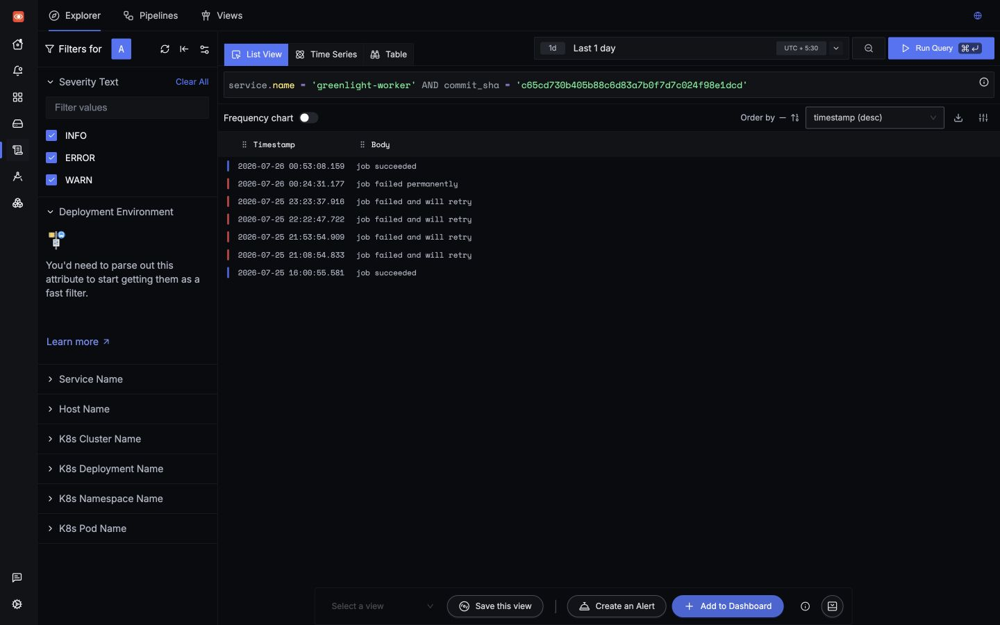

# CI said green. Production said otherwise: building an AI change flight recorder on SigNoz

A one-line configuration change passed every CI check, was reviewed, and
shipped. Production p95 latency on the affected endpoint then rose **7.3×**.

Nothing was broken in a way CI could see. The value was valid, the file parsed,
the tests passed, and the container built. The failure lived in the gap between
“the pipeline is green” and “the change is safe.”

That gap is what I built **GreenLight** to record for the
[WeMakeDevs × SigNoz hackathon](https://www.wemakedevs.org/hackathons/signoz),
Track 3: Build Your Own.

- [Source code and reproducible setup](https://github.com/sid12701/greenlight-ai-change-flight-recorder)
- [Watch the 2:25 demo video on YouTube](https://www.youtube.com/watch?v=QiWLpvP3vXc)
- [Download the H.264/AAC demo file](signoz-hackathon-end-to-end-demo.mp4)



## The problem

AI coding tools can produce and ship changes faster than a person can manually
follow each one into production. CI tells us whether a change passed its known
checks. Observability tells us what the running system did. What is usually
missing is a trustworthy link between those two stories.

GreenLight is for the engineer holding a commit SHA during an incident and
asking:

1. Which CI run approved this exact commit?
2. Which immutable version was deployed?
3. What did latency and errors do while that version served traffic?
4. Can every supporting trace, log, and dashboard link still be opened?
5. Did a later version measurably recover the service?

GreenLight turns those answers into a change receipt. When evidence is missing,
the receipt says so. It never converts an absent link into a confident blank.

## The one-line regression

The recorded candidate is commit
[`2fa6e28`](https://github.com/sid12701/greenlight-ai-change-flight-recorder/commit/2fa6e2861eabf162a26af0d0ef012124865811df):

```diff
   "data_source": {
     "dns": "postgres://...",
     "max_open_conns": 20,
-    "max_idle_conns": 5
+    "max_idle_conns": 5,
+    "conn_max_lifetime": 1000000
   },
```

It reads like ordinary connection-pool tuning. But Blnk is written in Go, and a
JSON number decoded into `time.Duration` is interpreted as nanoseconds.
`1000000` is not roughly sixteen minutes; it is **one millisecond**. The service
discarded PostgreSQL connections almost as soon as it opened them.

The change passed all eight CI checks. Under measured traffic on `/balances`,
p95 moved from **1.44 ms to 10.45 ms**. A later revert,
[`c65cd73`](https://github.com/sid12701/greenlight-ai-change-flight-recorder/commit/c65cd730b405b88c6d83a7b0f7d7c024f98e1dcd),
measured **2.1 ms**, so recovery was observed rather than assumed.



## The workflow

GreenLight records this chain:

```text
AI session → commit → CI run → immutable deploy → telemetry window → verdict
```

The comparison unit is the deployed version, not elapsed wall-clock time. Each
Blnk deployment reports its commit SHA as `service.version`, and the verdict
queries use the same scope:

```text
service.name = "blnk-loan-workload"
service.version = "<commit SHA>"
deployment.environment.name = "hackathon-demo"
http.route = "/balances"
```

That makes overlapping deployments, rollbacks, and delayed evaluation
unambiguous. The baseline can have been frozen hours earlier; it still refers to
one immutable version.



The product consists of a React interface, a Fastify API, a PostgreSQL-backed
worker, and a third-party monitored workload:
[Blnk v0.15.1](https://github.com/blnkfinance/blnk/tree/v0.15.1), an
Apache-2.0 financial ledger. Blnk is fetched, pinned, and verified rather than
vendored. It knows nothing about GreenLight, which matters: this is not a demo
service written to contain a bug the demo knows how to find.

OpenTelemetry carries GreenLight and Blnk traces, metrics, and logs into a
self-hosted SigNoz stack. The submitted stack pins SigNoz `v0.134.0`, its
collector dependencies, and SigNoz MCP `v0.9.0` by manifest digest.

## SigNoz is the evidence system

SigNoz is not a dashboard added after the product was finished. It decides and
supports every production claim on the receipt.

### Traces decide the verdict

GreenLight sends two Query Builder v5 trace queries for each window. One returns
request count, p90, and p95. The other counts spans with `has_error = true` over
the same service, version, environment, and route.

The applied policy requires:

| Guard | Rule |
|---|---|
| Latency | observed p95 > baseline × 1.5 **and** > baseline + 2 ms |
| Error rate | observed ≥ baseline + 2 percentage points **and** ≥ 5% |
| Data | at least 200 completed spans in both windows |

The 2 ms absolute floor is deliberately a timing-resolution guard, not a
human-perception threshold. An earlier 250 ms floor silently exempted fast
routes: this 7.3× regression would have needed to become a 174× regression
before qualifying. Every stored verdict records its policy version so an old
receipt still explains the rules that decided it.



### Dashboards make versions comparable

Three imported dashboards cover deployment impact, GreenLight’s own health, and
pipeline health. The most important panel groups p95 by `service.version`, so
baseline, candidate, and recovery appear as distinct series. An empty error
panel is meaningful in this run: the measured candidate window had zero errors;
latency alone caused the verdict.



### Links resolve to real traces

Evidence links are not decorative. The receipt-link verifier opens every
published commit, CI, trace, deployment, and source link. One cited slow request
resolves in SigNoz as an 83 ms `/balances` trace with two spans, zero errors, and
a 78.77 ms `GetAllBalances` child span.



### Alerts follow the deployed service

The project imports two Query Builder v5 rules: p95 latency and a true error
rate, computed as errored spans divided by all spans. They deliberately do not
pin `service.version`. A version-pinned alert could only describe a version that
already existed when the rule was written; the alert must follow whatever is
currently deployed, while the receipt answers what one specific version did.

The p95 history contains four observed fired-and-resolved cycles. The
authenticated GreenLight webhook receiver is independently verified, but
SigNoz-to-receiver delivery was not observed during the rehearsal. The
submission does not claim that it was.



### Logs preserve the commit join

API and worker logs ship over OTLP with trace context. Jobs that refer to a
change also carry `commit_sha`, because an investigator normally arrives with a
commit, not a queue job ID. Filtering on the recovery SHA exposes retries, a
permanent failure, and the later successful job without guessing from
timestamps.



### MCP gives an agent-native investigation path

GreenLight asks the SigNoz MCP server the same question an investigating agent
would: compare baseline and candidate p95 and error rate for one route, then
return the slowest traces. The recorded capture has no direct-query fallback, so
it either came from MCP or the capture failed.

Across the capture’s wider 15-hour window, MCP reported:

| | baseline `6f458c9` | candidate `2fa6e28` |
|---|---:|---:|
| p95 | 1.58 ms | 9.39 ms |
| error rate | 0% | 9.13% |

The wider window includes an earlier, deliberately separate dependency-failure
rehearsal for the same candidate version, which is why its error rate differs
from the receipt’s zero-error measured window. Same version, different windows,
different correct answers. The transcript cites three trace IDs, and all three
resolve to two spans.

## What running the whole system taught me

The most useful part of the hackathon was discovering how many plausible claims
collapsed under end-to-end verification.

**The load generator measured itself.** It accepted a duration flag but did not
pace requests. Hundreds of calls finished almost instantly, Blnk’s own rate
limiter rejected many of them, and a “healthy” baseline showed an error rate
created by the test tool.

**A container health check could never pass.** The deployment worker reached
the host through `host.docker.internal`, while the origin allowlist only
permitted container-local `127.0.0.1`. The fail-closed behavior was correct; the
configuration had never been exercised through the real container path.

**Missing AI evidence was labelled malformed.** A parser result object was
truthy even when no Git trailer existed, making a dead branch report every
missing AI link as invalid. That wording falsely implied an attempted link. The
receipt now distinguishes `missing`, `invalid`, and `verified`.

**The first demo mixed two incidents.** A PostgreSQL outage was injected inside
the candidate’s measured window, so the verdict fired on an error rate unrelated
to the configuration change. The honest fix was not better narration; it was
separating the clean change chain from the explicitly named
dependency-failure scenario.

The receipt therefore carries a load-bearing caveat:

> Deployment correlation is evidence of temporal and version association, not
> proof that every observed failure was caused by the commit.

## Reproduce it locally

Prerequisites are Node 24, Docker Compose v2, Git, curl, OpenSSL, and SigNoz
Foundry `v0.2.16`.

```bash
git clone https://github.com/sid12701/greenlight-ai-change-flight-recorder
cd greenlight-ai-change-flight-recorder
npm ci
cp .env.demo.example .env.demo
npm run demo:up
```

The first run creates private local credentials and pauses with one explicit
manual step: sign in to local SigNoz, create a service-account API key, add it
to `.env.demo`, and rerun `npm run demo:up`. The repository never commits that
key.

Useful verification commands:

```bash
npm run verify
npm run test:e2e
npm run validate:signoz-assets
bash scripts/signoz-runtime-verify.sh
npm run verify:receipt-links
npm run mcp:verify
```

The final clean-room run used Node 24 and passed lint, type-checking, all builds,
224 tests, the browser smoke test, 24 receipt links, three dashboard assets, two
alert assets, six runtime image-digest checks, and three MCP trace resolutions.
Thirteen tests were reported as skipped by the normal suite; nine live
PostgreSQL integration cases remain opt-in because the test database URL is not
exposed by the demo environment.

## Limitations and honest boundaries

- The recorded commits have no resolvable Claude Code session span. The AI link
  is shown as missing. The hook is armed, but the required Claude telemetry
  environment and trace context were not present for those commits.
- Alert rules fired and resolved, but webhook delivery from SigNoz was not
  observed.
- SigNoz’s service-map page has no service graph for this workload because the
  current instrumentation does not create cross-service parent/child spans.
- The verified demo is local rather than publicly hosted; reproducing it
  requires the documented SigNoz API-key step.
- The verdict currently evaluates one route on one service. Its query scope is
  parameterised, but baseline selection is still a frozen last-known-good
  deployment rather than a rolling set of healthy versions.

## Closing

The recorded chain is intentionally small and complete: three real commits,
three real CI runs, three immutable deployments, one verified regression, and
one verified recovery.

GreenLight’s central idea is not that observability can prove a commit caused an
incident. It cannot. The idea is that a change receipt can make the available
evidence resolvable, version-scoped, and honest enough for a human or agent to
investigate without starting from guesswork.

**AI assistance disclosure:** Codex/ChatGPT and Claude Code were used for
planning, implementation, review, and submission preparation, as allowed by the
[hackathon rules](https://www.wemakedevs.org/hackathons/signoz/rules). All
repository commits remain reviewed and authored under the human maintainer’s
Git identity. See [PROVENANCE.md](PROVENANCE.md).

GreenLight is MIT licensed. Blnk is Apache-2.0 and belongs to its authors.
